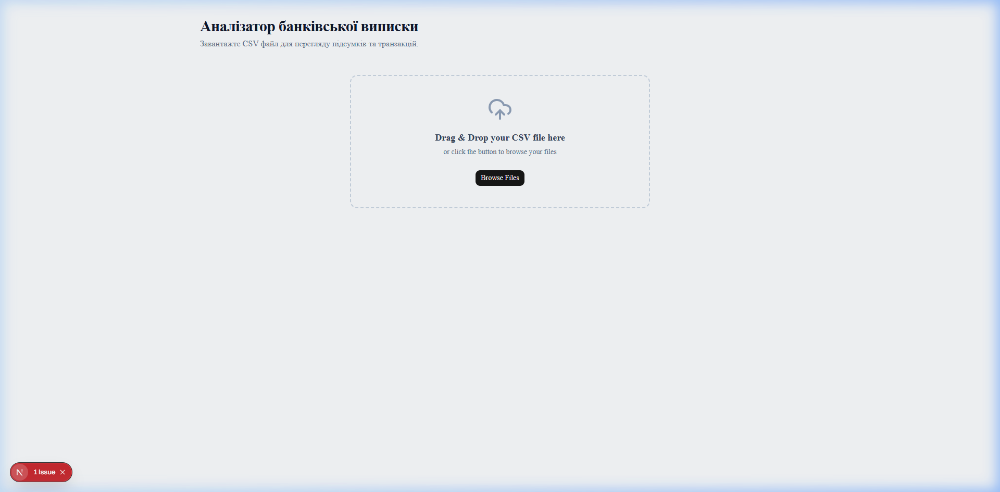
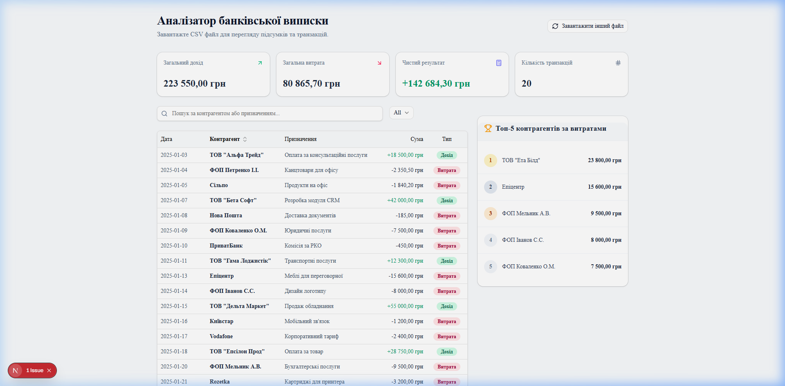
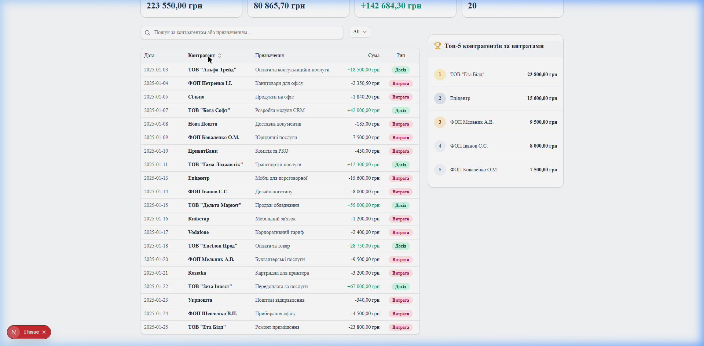
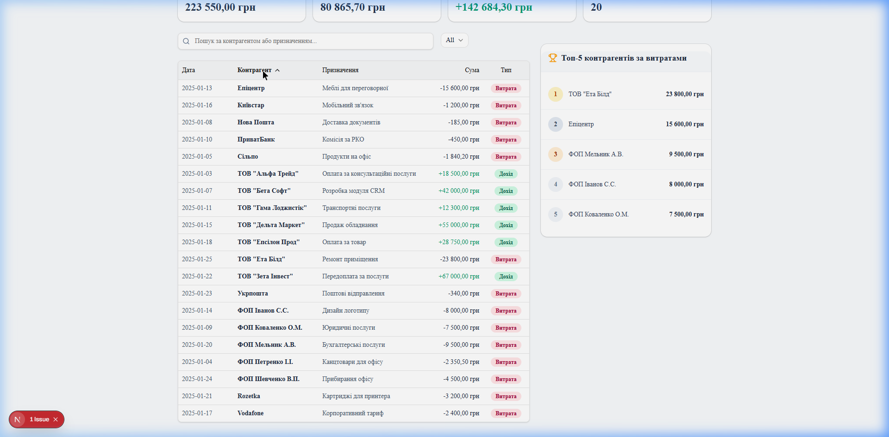
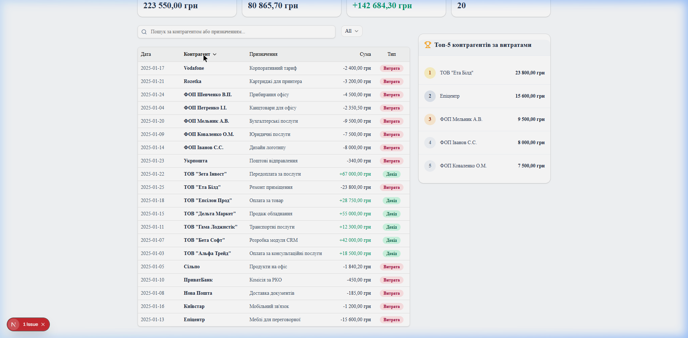
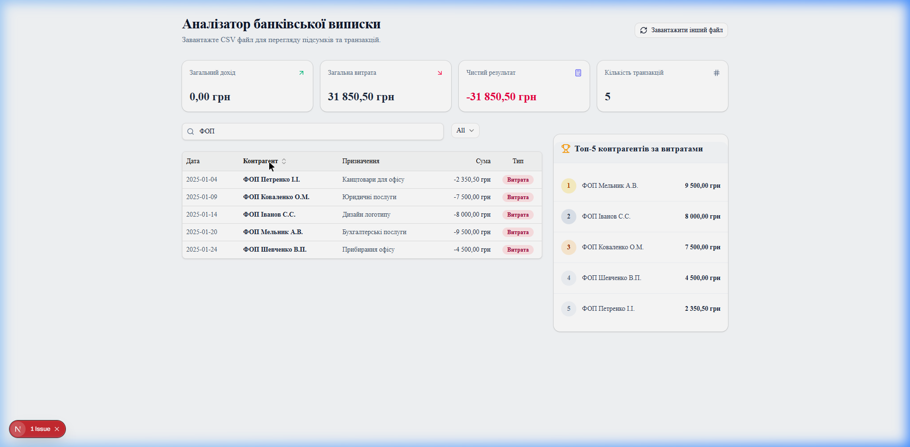

# Аналізатор банківської виписки

Це окремий Next.js застосунок для аналізу банківських виписок у форматі CSV, створений згідно з вимогами тестового завдання Junior Fullstack. Він містить таблицю транзакцій із інтерактивним сортуванням, зручною системою фільтрів та пошуку, а також картки фінансових підсумків.

## Функціональні можливості

- **Завантаження CSV** — Drag & Drop або вибір файлу через діалог
- **Валідація даних** — Zod перевіряє кожен рядок, невалідні пропускаються з лічильником помилок
- **Таблиця транзакцій** — перегляд усіх операцій з типами (Дохід / Витрата)
- **Сортування за Контрагентом** — три стани: А→Я ↑, Я→А ↓, скидання ↕
- **Пошук і фільтрація** — за назвою контрагента або призначенням платежу в реальному часі
- **Фінансові підсумки** — загальний дохід, витрата, чистий результат, кількість транзакцій
- **Топ-5 контрагентів** — за обсягом витрат

## Як запустити

```bash
# 1. Встановіть залежності
npm install

# 2. Запустіть сервер для розробки
npm run dev
```

Після цього відкрийте [http://localhost:3000](http://localhost:3000) у вашому браузері.

## Формат CSV-файлу

```
date,counterparty,description,amount
2025-01-15,ТОВ "Альфа",Оплата за послуги,15000.00
2025-01-16,ФОП Петренко,Повернення депозиту,-5000.00
```

- `amount > 0` — дохід, `amount < 0` — витрата
- Кодування UTF-8, роздільник — кома

## Технічний стек

| Технологія | Призначення |
|---|---|
| Next.js 15 (App Router) | Фреймворк |
| React 19 | UI-бібліотека |
| TypeScript (strict) | Типізація |
| Tailwind CSS | Стилізація |
| shadcn-ui | UI-компоненти (Table, Card, Input, Select) |
| Zod | Валідація рядків CSV |
| PapaParse | Парсинг CSV |
| Vitest | Юніт-тести |
| lucide-react | Іконки сортування |

## Сортування колонки «Контрагент»

Заголовок колонки «Контрагент» є інтерактивною кнопкою з трьома станами:

| Стан | Іконка | Опис |
|---|---|---|
| `none` | ↕ (прозора) | Початковий порядок (як у CSV) |
| `asc` | ↑ | Сортування А → Я |
| `desc` | ↓ | Сортування Я → А |

Цикл перемикання при кожному кліку: `none → asc → desc → none → ...`

Використовується `localeCompare` з параметрами `'uk'`, `sensitivity: 'base'`, `numeric: true` — коректне сортування кирилиці, латиниці та чисел у назвах.

## Відео демонстрація

### Повна демонстрація застосунку


### Демонстрація сортування контрагента


## Скріншоти

### 1. Порожній стан — до завантаження файлу



### 2. CSV завантажено — оригінальний порядок (↕)



### 3. Сортування А → Я (↑)

Порядок: Епіцентр → Київстар → Нова Пошта → ПриватБанк → Сільпо → ТОВ... → Укрпошта → ФОП... → Rozetka → Vodafone



### 4. Сортування Я → А (↓)

Порядок: Vodafone → Rozetka → ФОП... → Укрпошта → ТОВ... → Сільпо → ПриватБанк → Нова Пошта → Київстар → Епіцентр



### 5. Скидання сортування (↕)

Повернення до оригінального порядку CSV-файлу.



### 6. Фільтр «ФОП» + Сортування А → Я

Фільтр і сортування працюють одночасно.



## Перевірка якості коду

```bash
npx tsc --noEmit     # Перевірка типів TypeScript
npm run lint         # ESLint
npm run test         # Юніт-тести (Vitest)
```

## Про рішення

Найбільше уваги пішло на правильне налаштування парсингу CSV та жорстку типізацію валідації через Zod, щоб застосунок був стійким до пошкоджених рядків у виписці. Також було неочевидним уникнення помилок гідрації (hydration mismatch) у зв'язці Next.js 15 SSR + shadcn-ui компоненти, що потребувало використання нативного HTML-інпута. Для сортування використано `localeCompare` з українською локаллю — це забезпечує правильний алфавітний порядок кирилиці.
